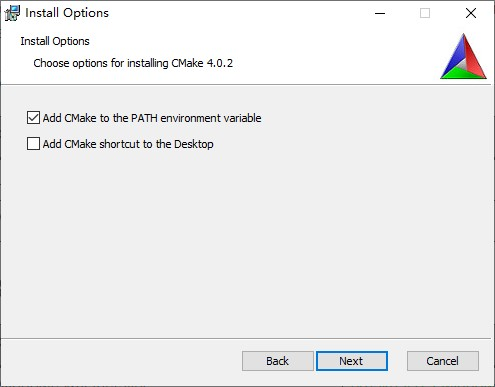
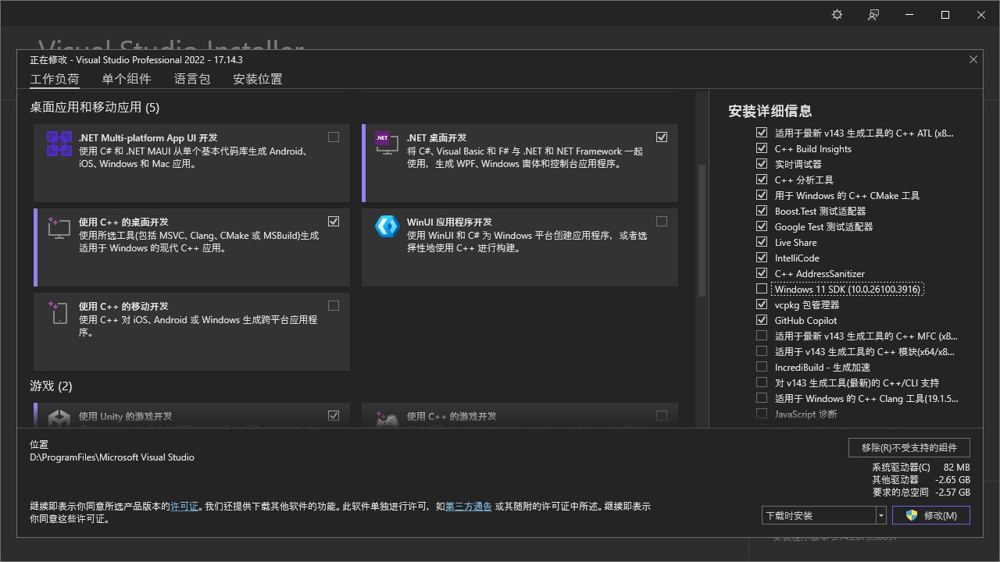
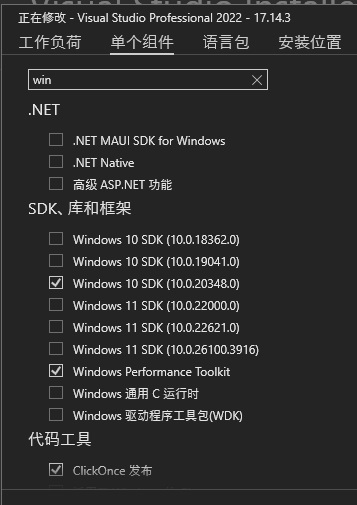

> 上图来源于官方源程序<a href="https://github.com/aseprite/aseprite/blob/main/data/icons/hd/asehd-blush.png" target="_blank">图标</a>

# 📃 前言

> **Aseprite** 是一款专有的、可获取源代码的图像编辑器，主要用于像素艺术绘画和动画。它可在 Windows 、macOS 和 Linux 上运行，并具有用于图像和动画编辑的不同工具，如图层、框架、图块地图支持、命令行界面、Lua 脚本等。它由 Igara Studio SA 开发，由开发人员 David、Gaspar 和 Martín Capello 领导。Aseprite 可以作为免费软件下载（尽管它没有保存精灵的功能），也可以在 Steam 或 Itch.io 上购买。Aseprite 源代码和二进制文件在 EULA 、教育和 Steam 专有许可下分发。  
此段摘自<a href="https://en.wikipedia.org/wiki/Aseprite" target="_blank">Aseprite 维基百科📙</a>。

由于从steam和官方网站获取软件都<span class="heimu" title="你知道的太多了">需要付费</span>不方便，但官方对软件开源并提供了编译教程[INSTALL.md](https://github.com/aseprite/aseprite/blob/main/INSTALL.md)，所以可以自己编译源代码来白嫖软件😋。

# 🧰 环境准备
在 github 上获取 <a href="https://github.com/aseprite/aseprite/releases/latest" target="_blank">Aseprite📥</a> 源代码。

下载编译所需要用到的工具：
- <a href="https://cmake.org/download" target="_blank">CMake📥</a>：自动化软件构建程序。
- <a href="https://github.com/ninja-build/ninja/releases/latest" target="_blank">Ninja📥</a>：高速构建系统，主要用于加速 C/C++ 项目的编译过程，与CMake配合使用。
- <a href="https://github.com/aseprite/skia/releases/latest" target="_blank">Skia📥</a>：2D图形库，但我们需要下载的是Aseprite魔改后的。
- **Windows 10 SDK**：编译环境，需要去微软官网下载 <a href="https://visualstudio.microsoft.com/zh-hans/downloads" target="_blank">Visual Studio Installer📥</a> 来安装。


## CMake
CMake直接下载最新MSI安装程序即可，在安装时勾选**Add CMake to the PATH environment variable**。

安装完成后打开CMD输入：
```sh
cmake --version
```
确认控制台输出的是CMake版本，如果显示**不是内部或外部命令，也不是可运行的程序或批处理文件**则需要添加CMake的bin目录到系统环境变量中。

## Ninja
从github上下载最新版`ninja-win.zip`后可以直接解压丢到CMake的bin目录，或着把它所在的目录添加到环境变量中。  
同样的需要和CMake一样在控制台中确认能够被调用：
```sh
ninja --veriosn
```
输出应为Ninja版本。

## Windows 10 SDK
从官网下载得到 `VisualStudioSetup.exe`，通过这个安装 Visual Studio Installer，如果已经安装过 Visual Studio，则直接在windows中搜索并打开即可。  
使用 Visual Studio Installer 添加或者修改已安装的 Visual Studio ，在**工作负荷**中勾选添加**使用C++的桌面开发**。

然后在**单个组件**的**SDK、库和框架中**仅勾选`Windows 10 SDK`。

完成以上设置后在右下角选择安装或者修改。

# 📦 目录配置
github上下载完 `Aseprite-Source.zip` 与 `Skia-Windows-Release-x64.zip` 解压Aseprite源码和Skia库，并创建 `build.bat`脚本来一键编译：
```
AsepriteBuild/
├── Aseprite-Source/
│   ├──cmake/
│   ├──data/
│   ...
│   ├──EULA.txt
│   └──README.md
├── Skia/
│   ├── include/
│   ├── modoules/
│   ...
│   ├── third_party/
│   └── LICENSE
└── build.bat
```

# 🛠️ 编译构建
编辑 `build.bat` 内容： 
```bat
@echo off
setlocal

::路径设置
set HOME_DIR=D:\User\Desktop\AsepriteBuild\
set SOURCE_DIR=%HOME_DIR%Aseprite-Source
set BUILD_DIR=%HOME_DIR%Output
set SKIA_DIR=%HOME_DIR%Skia
set VSDEVC="D:\ProgramFiles\Microsoft Visual Studio\Common7\Tools\VsDevCmd.bat"

:: 确保输出目录存在
if not exist "%BUILD_DIR%" mkdir "%BUILD_DIR%"

:: 进入输出目录并执行编译命令
cd /D "%BUILD_DIR%"

call %VSDEVC% -arch=x64

cmake -DCMAKE_BUILD_TYPE=RelWithDebInfo ^
    -DLAF_BACKEND=skia ^
    -DSKIA_DIR="%SKIA_DIR%" ^
    -DSKIA_LIBRARY_DIR="%SKIA_DIR%\out\Release-x64" ^
    -DSKIA_LIBRARY="%SKIA_DIR%\out\Release-x64\skia.lib" ^
    -G Ninja ^
    "%SOURCE_DIR%"

ninja aseprite

:: 提示完成
echo Aseprite Build Finished!

endlocal
pause
```
其中 `HOME_DIR` 需要改为 `build.sh` 文件所在的文件夹位置 `VSDEVC` 要根据 Visual Studio 安装位置更改。修改完成后执行，等待编译完成后打开`.\OutPut\bin`，里面就是编译好可以使用程序的啦 *★,°*:.☆(￣▽￣)/$:*.°★* 。

:::note
若在Ninja编译过程中出现如 ` warning C4819: 该文件包含不能在当前代码 页(936)中表示的字符。请将该文件保存为 Unicode 格式以防止数据丢失` 之类的警告是正常的，不用理会。
:::